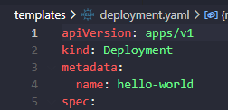

# 👋 Welcome to Helm for beginners 

<!--  -->

This repository provides a walkthrough on Helm, covering topics such as Helm components, Helm charts, working with Helm, customizing chart parameters, lifecycle management, writing a chart, ensuring chart functionality, functions, and more.

<br>

## Pre-requisites 👍

Pre-requisites for the repo are access to a Kubernetes/K8 cluster. Have no fear if you do not have access to a k8 cluster. You can create one easily by installing one of the following Kubernetes distribution tools such as minikube, k3d, or kind. Details on Kubernetes distribution installers can be found below.

<br>

## Kubernetes Distribution Tools
<details>
  <summary>Kubernetes distributions installers</summary>
  <br>

  # K3d

  k3d is a lightweight wrapper to run k3s (Rancher Lab’s minimal Kubernetes distribution) in docker.

  You can install K3D via :-

  #### Chocolatey
  ```
  choco install k3d
  ```
  For k3 cluster management check out vscode extension [vscode-k3d](https://github.com/k3d-io/vscode-k3d).

  VS Code quick install below.
  ```
  code --install-extension inercia.vscode-k3d
  ```
  #### Homebrew (macOS)
  ```
  brew install k3d
  ```
  More K3d install options can be found [here](https://k3d.io/v5.5.1/#installation).


  # minikube

  minikube is local Kubernetes, focusing on making it easy to learn and develop for Kubernetes.

  You can install minikube via :-

  #### Chocolatey
  ```
  choco install minikube
  ```

  #### Homebrew (macOS)
  ```
  brew install minikube
  ```

  More minikube install options can be found [here](https://minikube.sigs.k8s.io/docs/start/).

  # kind

  kind is a tool for running local Kubernetes clusters using Docker container “nodes”. kind was primarily designed for testing Kubernetes itself, but may be used for local development or CI.
  You can install kind via :-

  #### Chocolatey
  ```
  choco install kind
  ```

  #### Homebrew (macOS)
  ```
  brew install kind
  ```
  More kind install options can be found [here](https://kind.sigs.k8s.io/docs/user/quick-start/).

</details>

#

## What is Helm?

Helm is a package manager for Kubernetes. It determines which package to act upon and what objects to change.  It allows a user to 'install', 'upgrade', and 'rollback' packages which are referred to as 'charts'.
Charts are a collection of files. They contain all the instructions Helm needs to be able to create the collection of objects needed in your Kubernetes cluster. By packaging all the required files and instructions within a chart, Helm enables easy distribution, versioning, and management of applications on Kubernetes.

### Installing Helm
Helm can be installed via the command line:

Chocolatey

```
choco install kubernetes-helm
```

Winget
```
winget install Kubernetes-Helm
```

Homebrew (macOS/Linux)
```
brew install helm
```
Alternatively, you can install it from the official [GitHub repository](https://github.com/helm/helm/releases).

### QuickStart
In the command line type the following:-
```
helm create myhelmdemo
```
A folder named myhelmdemo will be created containing the following files and directories.


Replace the contents of file `deployment.yaml` with the code below.

```
apiVersion: apps/v1
kind: Deployment
metadata:
  name: hello-world
spec:
  replicas: 2
  selector:
    matchLabels:
      app: hello-world
  template:
    metadata:
      labels:
        app: hello-world
    spec:
      containers:
        - name: hello-world
          image: nginx
          ports:
            - containerPort: 80
              name: http
              protocol: TCP
```

Now replace the contents of service.yaml with the following code:-

```
apiVersion: v1
kind: Service
metadata:
  name: hello-world
spec:
  type: NodePort
  ports:
    - port: 80
      targetPort: http
      protocol: TCP
      name: http
  selector:
    app: hello-world
```

Lastly, replace the NOTES.txt content with the following code:

```
Thank you for supporting the DevOpsCoderio Repository.
{{- if .Values.ingress.enabled }}
{{- range $host := .Values.ingress.hosts }}
  {{- range .paths }}
  http{{ if $.Values.ingress.tls }}s{{ end }}://{{ $host.host }}{{ .path }}
  {{- end }}
{{- end }}
{{- else if contains "NodePort" .Values.service.type }}
  export NODE_PORT=$(kubectl get --namespace {{ .Release.Namespace }} -o jsonpath="{.spec.ports[0].nodePort}" services {{ include "myhelmdemo.fullname" . }})
  export NODE_IP=$(kubectl get nodes --namespace {{ .Release.Namespace }} -o jsonpath="{.items[0].status.addresses[0].address}")
  echo http://$NODE_IP:$NODE_PORT
{{- else if contains "LoadBalancer" .Values.service.type }}
     NOTE: It may take a few minutes for the LoadBalancer IP to be available.
           You can watch the status of by running 'kubectl get --namespace {{ .Release.Namespace }} svc -w {{ include "myhelmdemo.fullname" . }}'
  export SERVICE_IP=$(kubectl get svc --namespace {{ .Release.Namespace }} {{ include "myhelmdemo.fullname" . }} --template "{{"{{ range (index .status.loadBalancer.ingress 0) }}{{.}}{{ end }}"}}")
  echo http://$SERVICE_IP:{{ .Values.service.port }}
{{- else if contains "ClusterIP" .Values.service.type }}

  For Unix-based systems:

  export POD_NAME=$(kubectl get pods --namespace {{ .Release.Namespace }} -l "app.kubernetes.io/name={{ include "myhelmdemo.name" . }},app.kubernetes.io/instance={{ .Release.Name }}" -o jsonpath="{.items[0].metadata.name}")
  export CONTAINER_PORT=$(kubectl get pod --namespace {{ .Release.Namespace }} $POD_NAME -o jsonpath="{.spec.containers[0].ports[0].containerPort}")

  Windows:

  $POD_NAME=$(kubectl get pods --namespace {{ .Release.Namespace }} -l "app.kubernetes.io/name={{ include "myhelmdemo.name" . }},app.kubernetes.io/instance={{ .Release.Name }}" -o jsonpath="{.items[0].metadata.name}")
  $CONTAINER_PORT=$(kubectl get pod --namespace {{ .Release.Namespace }} $POD_NAME -o jsonpath="{.spec.containers[0].ports[0].containerPort}")


  Finaly, run:

  echo "Visit http://127.0.0.1:8080 to use your application"
  kubectl --namespace {{ .Release.Namespace }} port-forward $POD_NAME 8080:$CONTAINER_PORT
{{- end }}

Thank you fro supporting the DevOpsCoderio Repository.
Check out the devopscoder blog at https://ghost.devopscoder.io
```


Now, back to your cli, ensure you are one level below the directory myhelmdemo.

Run the following command:

```
helm install docdemo myhelmdemo
```


`helm`: This is the command-line tool used for managing and deploying applications on Kubernetes.

`install`: This is the Helm command that instructs Helm to install a chart onto the Kubernetes cluster.

`docdemo`: This is the release name. This is a user-defined identifier for the specific installation of the chart. It helps to differentiate and manage different installations of the same chart.

`myhelmdemo`: This is the name of the chart or the chart reference. It refers to the Helm chart package that you want to install. In the case of this demo, we are referencing a local chart.

**Congratulations** you have just deployed your first helm chart but what happens if run/deploy a new release?

In your cli run the following command line

```
helm install docdemo2 myhelmdemo
```

You should receive the following `*Error: INSTALLATION FAILED: rendered manifests contain a resource that already exists. Unable to continue with install: Service "hello-world" in namespace "default" exists and cannot be imported into the current release: invalid ownership metadata; annotation validation error: key "meta.helm.sh/release-name" must equal "docdemo2": current value is "docdemo"*`


But why has this occurred?

In our copied code we have a static value set for our service and deployment name.




We resolve this by templatizing the name of the deployment and service within our files.
